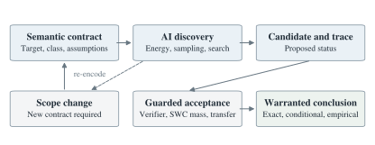

## Abstract

Tomita Energy Logic (TEL) is proposed as a candidate physics-grounded foundation for AI reasoning and proof. Learned representations, energy-guided search, sampling, and countermodel challenges produce candidate conclusions and inference rules; semantic contracts govern acceptance. We formalize these transitions using stochastic witness calculus, explicit scope, conflicting-evidence registers, and empirical risk bounds. A soundness theorem covers admitted transitions, and an adaptive exploration theorem gives quantitative witness-discovery guarantees even when the learned policy changes after every trial. Across 70 training splits of a three-variable Boolean universe, 51.0% of zero-training-violation proposals fail full-model validation, and exact admission rejects them. On 45 satisfiable random twelve-variable SAT instances, an optimized product policy has a 656.6-fold median accepted-mass gain over uniform sampling without noise, with seven regressions. Exact evaluations under modeled bit-flip noise retain substantial median gains. The companion RH study adds centered-tail bounds, compact exact dual certificates, and larger finite descent experiments. These results establish finite computational claims and conditional guarantees; they do not establish a replacement for mathematical truth, a runtime or physical-energy advantage, or a proof of RH.

**Keywords:** AI reasoning; energy minimization; witness verification; operational semantics; conflicting evidence; stochastic witness calculus; empirical certification.

## 1. The proposed shift and its scope

The motivating idea is that an AI reasoning system need not discover its answers by executing a human-authored proof script. It may form distributed representations, search an energy landscape, generate candidate rules, simulate alternatives, and revise its internal state. TEL makes those processes primary at the execution layer. A successful reasoning episode is recorded as a reproducible state transition with explicit grounds for accepting its output.

This is the intended meaning of the Tomita paradigm in this proposal. Its ambition is to provide an alternative foundation of warranted reasoning that could replace parts of conventional inference systems where it demonstrates better operational reliability. That ambition includes foundational questions, not only faster proof search. The present specification establishes a candidate architecture and some conditional metatheorems; it does not establish a completed replacement for classical mathematical consequence. The framework name does not establish priority. Energy-based neural computation, differentiable inference, neural proof guidance, and multivalued evidence systems have substantial prior histories.

Hopfield's graded-response networks connect collective neural dynamics with computational behavior [1]. Neural theorem provers replace parts of symbolic operations with differentiable representations [2], while probabilistic soft logic provides structured probabilistic models with convex inference [3]. Recent neural provers also integrate learned search and externally checked formal proof objects [4]. TEL draws on these lines without claiming their underlying mechanisms as new inventions.

The author's stochastic witness calculus (SWC) [5] supplies the exact positive-mass component. TEL adds an operational account of changing representations, semantic scope, evidence conflicts, and the separation between a discovery loss and the property ultimately claimed. Its formal notation describes those processes so they can be inspected and implemented. It does not require the discovery engine itself to reason exclusively through conventional symbolic deduction.

This distinction matters for the phrase AI-based proof. In TEL, an AI may find a witness by any effective process, including an opaque trained model. Whether the final result is an exact existence theorem, a conditional theorem, a finite experiment, or empirical evidence depends on its acceptance contract. An unsupported model output does not acquire a stronger status merely by being called a new kind of logic.

## 2. Semantic contracts and operational states

**Definition 2.1 (semantic contract).** An instance carries a contract

$$
% eq:contract
C_i=(i,W_i,R_i,A_i,V_i,\mathcal T_i).
$$

Here $i$ identifies the instance; $W_i$ is the admissible witness space; $R_i(w)$ is the claimed property; $A_i$ records assumptions; $V_i$ is the acceptance procedure; and $\mathcal T_i$ is the evidence type. Examples of evidence types are exact witness, exact positive mass, conditional certificate, finite-domain coverage, and statistical evidence under a specified model. The contract also records the domain, units, tolerance, encoding version, and dependencies needed to interpret these fields.

**Definition 2.2 (operational state).** A TEL state has the form

$$
% eq:state
X_t=(C_i,\theta_t,z_t,\mu_t,\mathcal E_t,\mathcal L_t).
$$

The model parameters $\theta_t$ and internal state $z_t$ determine a proposal mechanism. The law $\mu_t$ describes its declared randomness. The energy specification $\mathcal E_t$ includes the discovery objective and any admissibility penalty. The ledger $\mathcal L_t$ records hypotheses, certificates, challenges, and the assumptions on which they depend. A state transition may update proposals or numerical diagnostics without changing the acceptance status of any claim.

**Semantic anchoring.** A change to the target, witness class, tolerance, or assumptions creates a new contract unless an explicit transfer argument relates the two contracts. For example, replacing a linear approximation class by one allowing a neural clipping operation changes the witness class. Likewise, subtracting an unknown minimum from a loss changes what zero loss means. A stored identifier or hash helps detect such changes, but is not itself a proof of semantic equivalence or an authentication of an author.

This contract is intended to prevent a common failure of optimization-led reasoning: improving a surrogate objective and silently reporting the result as a solution to the original problem. The original claim remains stable while the proposal system is free to change.

**Operational consequence.** Write $\Gamma\Vdash_{\mathrm{TEL}}^{C,\tau}P$ when a finite audited TEL record licenses $P$ under contract $C$, evidence type $\tau$, and the retained assumptions $\Gamma$. This is the proposed consequence relation of the framework. In its exact mode, the current guarded rules compile into ordinary justified conclusions. In empirical mode, the conclusion is a model- and protocol-indexed warrant. These are deliberately distinct meanings; substituting the empirical relation for mathematical entailment requires a translation theorem, not a change of notation.

## 3. Energy-guided discovery

A general discovery objective can combine a task residual with penalties for leaving a declared class:

$$
% eq:energy
\mathcal E_\theta(z;i)=\ell_i(\operatorname{Dec}_\theta(z))
+\lambda a_i(\operatorname{Dec}_\theta(z)).
$$

The decoder maps a latent state to a candidate object. The quantities $\ell_i$ and $a_i$ are a task loss and an admissibility penalty. A system may use gradients, reinforcement learning, discrete search, or a mixture. TEL does not assume that every objective is differentiable, convex, or physically realizable. These are properties to establish for a particular instance.

One possible continuous evolution is

$$
% eq:dynamics
dz_t=-P_t\nabla\mathcal E(z_t)\,dt+\sqrt{2T_tP_t}\,dB_t,
$$

with a fixed positive-definite preconditioner when a conventional Gibbs interpretation is intended. Time-dependent schedules, state-dependent preconditioners, and finite numerical discretizations require their own stability and sampling analyses. The equation is an example of an execution mechanism, not a universal correctness rule.

**Proposition 3.1 (descent is not zero-energy certification).** For deterministic gradient flow of a differentiable objective, the identity $d\mathcal E/dt=-\|\nabla\mathcal E\|^2$ establishes nonincrease where the flow exists. It does not establish that the limiting value is zero, that a stationary point is globally optimal, or that an optimum satisfies the semantic contract.

**Proof.** The derivative identity is the chain rule. The energy $\mathcal E(x)=x^2+1$ has a unique global minimum with derivative zero and value one. More generally, replacing an energy by $\mathcal E+b$ leaves its gradients unchanged while shifting its minimum by $b$. Thus gradient information alone cannot certify an absolute zero for all energies. For a specified objective, additional information can of course establish its value. The proposition excludes an automatic inference from stationarity, not the use of optimization in a valid proof.

The same distinction applies to normalized Gibbs laws: the factor $e^{-b/T}$ cancels between numerator and normalizing constant. Low temperature concentrates samples near an existing minimum; it does not establish that the minimum encodes a true conclusion. A correct encoding requires a separate implication from the accepted energy condition to $R_i$.

Physical implementation does not remove this requirement. Landauer's principle concerns entropy consequences of logically irreversible operations [6]. The familiar heat scale for idealized erasure of an unbiased bit does not certify the correctness of an arbitrary objective. The philosophical thesis that logic emerges from physical organization may motivate a research program, but the thesis is not established by the optimization identities above.

### 3.1. Learning inference rules, not only candidate answers

The most ambitious component of TEL is a rule-learning layer. Its proposal space contains transformations between claims, rather than only witnesses for a fixed claim. A learned model can propose a shortcut, decomposition, latent representation, or inference schema. Each proposed rule must declare the models or physical scenarios to which it applies.

For a rule with premises $P_1,\ldots,P_m$ and conclusion $Q$, exact admission requires the semantic obligation

$$
% eq:ruleadmission
\forall\omega\in\Omega_C:\quad
\left(\bigwedge_{j=1}^{m}P_j(\omega)\right)\Rightarrow Q(\omega).
$$

Here $\Omega_C$ is the model class specified by the contract. A training loss can penalize sampled countermodels and rule complexity, but a zero empirical violation rate is not itself @eq:ruleadmission. An adversarial search tries to find a state where all premises hold and the conclusion fails. Such a state refutes the proposed rule within that scope. Failure to find one establishes validity only when the search exhausts a declared finite model class or another complete argument applies.

The admission procedure has three outcomes. A rule with a checked semantic justification becomes available to later reasoning episodes under its recorded dependencies. A rule supported only by statistical tests retains an empirical status and its model assumptions. A rule that introduces a genuinely new primitive principle is recorded as an additional axiom rather than silently certified by its own consequences. Counterexample-driven synthesis is an established tradition [10]; TEL does not claim to invent the separation between candidate generation and semantic checking.

This permits learned shortcuts to replace hand-designed search or derivation patterns while preserving their meaning. It also allows a research program that proposes alternative primitives. The latter program must examine consistency, expressive power, and translation to the target claims; successful optimization is not a substitute for that analysis. An accepted rule is frozen with its contract. Changing its decoder, premise class, or learned implementation triggers revalidation of dependent claims.

If all admitted exact rules satisfy @eq:ruleadmission and the initial premises hold in the intended models, induction over any finite derivation shows that its conclusions hold there. This is the semantic guarantee for learned inference. Section 7 adds a finite rule-proposal study, but does not implement a general end-to-end neural rule-learning system. Scaling that layer and comparing it with existing neural-symbolic and proof systems remains a central experiment.

## 4. Rules for warranted transitions

TEL distinguishes transitions that change the search state from transitions that license a conclusion. This is an operational inference system: a transition is permitted only when its stated guards hold.

**Proposal rule.** A learned generator may add a candidate or hypothesis to the ledger. Its status is proposed. A high model score, low surrogate loss, or repeated agreement among model outputs does not by itself promote the status.

**Evolution rule.** A recorded optimization or sampling step updates parameters, candidates, and diagnostics. If the contract is unchanged, previously checked results remain attached to that contract. An optimizer failure does not refute the target relation unless a separate obstruction certificate establishes impossibility.

**Witness rule.** If the verifier is sound for the contract and accepts a concrete admissible witness, the system may record an exact existence conclusion:

$$
% eq:witness
V_i(w)=1,\quad V_i(w)=1\Rightarrow R_i(w)
\quad\Longrightarrow\quad \exists w\in W_i:R_i(w).
$$

**Mass rule.** SWC permits existence without an explicitly extracted witness when exact accepted mass is positive:

$$
% eq:mass
\mu_i\{w:V_i(w)=1\}\geq\delta_i>0
\quad\Longrightarrow\quad \exists w\in W_i:R_i(w),
$$

again under verifier soundness. A Monte Carlo estimate of this mass is a different evidence object. A very small positive lower bound affects search cost but not the existence implication.

**Composition rule.** A sequential construction can combine accepted stages when its conditional mass obligation is proved:

$$
% eq:compose
\Pr(A)\geq\delta>0,\quad\Pr(B\mid A)\geq\gamma>0
\quad\Longrightarrow\quad\Pr(A\cap B)\geq\delta\gamma.
$$

Positive marginal masses alone are insufficient: two disjoint events can each have probability one half. For finite independent trials with success mass at least $\delta$, the failure probability after $m$ trials is at most $(1-\delta)^m$. This concerns finding a witness for the declared instance, not the probability that an unrelated universal conjecture is true.

**Transfer rule.** Suppose an intermediate neural output $H$ and a final admissible witness $F$ satisfy verified norm bounds. Then

$$
% eq:transfer
\|\chi-H\|^2\leq a,\quad\|H-F\|^2\leq b
\quad\Longrightarrow\quad\|\chi-F\|^2\leq(\sqrt a+\sqrt b)^2.
$$

This triangle-inequality rule makes an explicit bridge between a relaxed representation and the original class. The mass claim must cover the jointly valid pair, or follow from a justified sequential composition. Certifying the neural output without the bridge does not establish the original claim.

**Family rule.** A universal conclusion requires a proof whose obligations cover every intended instance:

$$
% eq:family
\forall i\in I:\ \mu_i(V_i=1)\geq\delta_i>0
\quad\Longrightarrow\quad\forall i\in I\ \exists w\in W_i:R_i(w).
$$

The magnitude of $\delta_i$ need not have a common positive lower bound. The scope of positivity must nevertheless include every $i$. A finite list, a positive average, or an accuracy index sampled from a distribution does not automatically meet this obligation.

**Theorem 4.1 (conditional soundness of exact TEL conclusions).** Assume the primitive verifier and transfer contracts are sound, all exact mass calculations are valid probability bounds, and every family guard has its declared scope. Then exact existential conclusions generated by finite compositions of the witness, mass, composition, transfer, and family rules are valid under their recorded assumptions.

**Proof.** Induct on the derivation record. The witness case is its soundness implication. In the mass case, an empty accepted set would have zero measure, contradicting the positive lower bound. Composition is the conditional probability identity. Transfer is the triangle inequality. The family case applies the corresponding pointwise result under the universal guard. Search-state transitions introduce no exact conclusion and therefore preserve the invariant. This theorem assumes valid primitive contracts; recording a Boolean field named sound does not satisfy that premise.

The theorem explains the relation to established logic. Exact TEL conclusions are conservative when these contracts are formalized in an ambient sound setting. The proposed novelty lies in the organization of AI reasoning and its evidence interface, not in a new axiom that makes an open proposition true. A proof may be discovered through continuous computation while its final validity still has an explicit justification.

### 4.1. Adaptive exploration with a discovery guarantee

A learned policy can concentrate on a false basin or discard a rare valid witness. TEL can preserve discovery guarantees by mixing learned proposals with a declared reference law. This is an operational use of positive mass: the reference distribution supplies coverage while the learned component may improve efficiency.

**Theorem 4.2 (adaptive discovery and fair multi-level search).** Let $A$ be the accepted set for a fixed sound verifier, and suppose a reference law satisfies $\mu_0(A)\geq\delta>0$. At trial $t$, conditionally on the complete past, use the mixture $\mu_t=(1-\epsilon_t)\nu_t+\epsilon_t\mu_0$, where $\nu_t$ is any history-dependent proposal law and the deterministic weights satisfy $0\leq\epsilon_t\leq1$. Then

$$
% eq:adaptivefailure
\Pr(\hbox{no accepted witness by }T)
\leq\prod_{t=1}^{T}(1-\epsilon_t\delta)
\leq\exp\left(-\delta\sum_{t=1}^{T}\epsilon_t\right).
$$

If $\sum_t\epsilon_t=\infty$, a witness is found almost surely. Independence of successive learned proposals is not required. For countably many fixed contracts with reference accepted masses $\delta_j>0$, independently choosing contract $j$ with probability $q_j>0$ at each trial gives the same bound with $\delta$ replaced by $q_j\delta_j$. Almost surely every fixed level is eventually certified. For the first $J$ levels, a finite-horizon bound is

$$
% eq:finitelevels
\Pr(\hbox{some level }j\leq J\hbox{ is still missing at }T)
\leq\sum_{j=1}^{J}\exp\left(-q_j\delta_j\sum_{t=1}^{T}\epsilon_t\right).
$$

**Proof.** On every failure history, the conditional probability of acceptance at trial $t$ is at least $\epsilon_t\delta$. Multiplying the resulting conditional failure bounds gives the first product; $1-x\leq e^{-x}$ gives the exponential bound. A divergent exploration sum forces the infinite failure probability to zero. At a fixed level $j$, independent level selection multiplies the lower bound by $q_j$. A countable union of zero-probability failure events proves the eventual pointwise statement, and a finite union bound proves @eq:finitelevels.

The theorem allows arbitrary learned search behavior while preserving a stated discovery guarantee. It is an application of elementary conditional probability, not a claim to invent mixture exploration. It assumes the positive-mass bounds; it does not manufacture them from optimization. Almost-sure eventual success at each level is also not a finite stopping time at which an infinite family has been completely checked. If the exploration weights have a finite sum, even a nonempty accepted set may be missed forever with positive probability. These distinctions give precise meanings to reliability claims in an adaptive TEL engine.

## 5. Contradictions as auditable evidence states

An AI can encounter support for a statement and support for its negation. Erasing one side to obtain apparent consistency loses information. TEL instead maintains provenance-bearing support registers, conceptually related to four-valued evidence traditions [7]:

$$
% eq:ledger
e(P)=(s^+(P),s^-(P))\in\{0,1\}^2.
$$

The four states are no recorded support, positive support, negative support, and conflict. These are evidence statuses, not a declaration that reality has four truth values. Each support item retains its evidence type and contract. Support under different assumptions is not automatically a same-context contradiction.

When a conflict occurs, TEL quarantines promotion of the disputed claim until the sources, scopes, and verification results are reconciled. It has no rule deriving an unrelated claim from the mere presence of conflicting support. If two alleged exact certificates establish opposite claims under identical assumptions, at least one certificate, contract, or dependency requires investigation. The framework does not claim to solve the consistency problem for arbitrary foundational systems.

A simple optimization example illustrates the distinction. The incompatible requirements $x=0$ and $x=1$ produce the continuous penalty

$$
% eq:conflict
L(x)=x^2+(1-x)^2=2(x-\tfrac12)^2+\tfrac12.
$$

The stable optimum is $x=1/2$ with positive loss. It represents a compromise in the relaxation, not satisfaction of both requirements. TEL retains the conflict and refuses a zero-violation claim.

## 6. Empirical mode and physical evidence

Empirical assertions require a data-generating model, a protocol, and a risk interpretation. TEL uses a separate evidence type for this purpose. For a nonnegative supermartingale $M_t$ under a declared null, with $M_0\leq1$, the standard time-uniform bound is

$$
% eq:empirical
\Pr_{H_0}\left(\sup_t M_t\geq1/\alpha\right)\leq\alpha.
$$

This is the established sequential-inference setting developed in modern confidence-sequence work [8]. It licenses a false-rejection guarantee under the null assumptions. It is not a posterior probability that a mathematical conjecture holds. Adaptively choosing the next action is permitted only when the required conditional supermartingale property remains valid.

If a system changes models or starts new testing epochs, it records separate budgets $\alpha_e$ with $\sum_e\alpha_e\leq\alpha$. A union bound then controls the combined risk provided each epoch's guarantee holds conditionally on the preceding history. Without those model-validity conditions, allocating numbers called risk budgets does not create a statistical guarantee.

Finite non-detection also cannot exclude arbitrarily rare alternatives without a sensitivity premise. If the probability of detecting an exception is $q$, independent non-detection in $n$ trials has probability $(1-q)^n$. For every finite $n$, this approaches one as $q$ approaches zero. A positive-mass lower bound for finding a good approximation is not a lower bound for detecting every possible counterexample to a different claim.

## 7. Finite experiments and protocol audits

### 7.1. Rule discovery from incomplete observations

The first new experiment minimizes empirical rule-violation energy in a finite Boolean setting. Its universe has three propositional variables and eight assignments. Twelve fixed features include the variables, their negations, selected implications, conjunction, disjunction, and equivalence. Candidate rules have two distinct premises and a syntactically different conclusion. Rules whose premises are never jointly true are excluded. This leaves 610 candidates, of which 146 are valid over the full universe.

For each of the 70 possible four-assignment training subsets, the discovery stage proposes every rule with zero training violations. It then passes those rules to an independent full-truth-table admission criterion. The operation is discrete empirical-energy minimization over a fixed grammar, not a trained language model or a claim to discover new foundational axioms.

Across all training splits there are 20,866 proposal-split pairs. Of these, 10,646, or approximately 51.0%, are invalid on the full eight-assignment universe. Exact admission retains the 10,220 valid pairs and rejects all invalid pairs. Every split retains all 146 valid rules in the grammar. The aggregate percentage is a descriptive count over an exhaustively examined collection of overlapping splits, not an IID confidence estimate. The verified rules include familiar logical consequences; no novelty is claimed for their content.

This is a concrete reliability difference between accepting a fitted zero-energy condition and checking the proposed rule's full declared scope. The exact checker is also available to conventional logical systems. Its success does not establish that TEL is more sound than those systems or that an eight-model guarantee extends to arbitrary domains.

### 7.2. Learning witness mass under modeled noise

The second experiment optimizes an independent Bernoulli proposal distribution for Boolean assignments. Prior neural SAT and differentiable satisfiability work [11,12] motivates the domain; the experiment is a small transparent policy study rather than a reimplementation or competitive evaluation of those systems. Random-instance design matters for SAT comparisons [13], so the generator and all settings are retained explicitly.

The protocol fixes 12 variables and 51 distinct three-literal clauses per instance. It generates 64 random formulas without planting solutions, plus 16 controls made unsatisfiable by including all eight clauses over one three-variable cube. Exhaustive evaluation of all 4,096 assignments labels 45 of the random formulas satisfiable and 19 unsatisfiable. Thus the full collection contains 45 satisfiable and 35 unsatisfiable instances. A separately written scalar verifier checks the vectorized ground-truth table.

Each instance has 12 trainable logits. Eight independent initializations undergo 500 Adam steps at learning rate 0.08, minimizing the expected fraction of unsatisfied clauses:

$$
% eq:policyloss
L(\theta)=\frac1m\sum_{j=1}^{m}\prod_{\ell\in C_j}q_\ell(\theta).
$$

For a positive literal, $q_\ell=1-p_i$; for a negative literal, $q_\ell=p_i$, with $p_i$ the corresponding Bernoulli parameter. Each clause uses distinct variables, so independent proposal bits justify the product. This loss has an analytic gradient. The best restart is selected by that numerical loss, not by a subsequent mass comparison. Its probabilities are rounded to numerators from 1 through 255 over denominator 256. The strict clipping preserves support. Settings were frozen before this run; no public preregistration is claimed.

For each saved policy, a separate scalar-arithmetic checker recomputes exact accepted mass by summing integer product weights over satisfying assignments. It compares uniform sampling, the learned product law, and a mixture with one tenth uniform weight. The latter satisfies the SWC support bound $\delta_{\rm mix}\geq\delta_{\rm uniform}/10$.

An additional exact union-bound calculation certifies some positive masses without enumerating assignments: the valid-assignment probability is at least one minus the sum of the clause-failure probabilities. This sum uses the rounded rational policy and does not assume independence between different clauses. A positive lower bound proves existence for that finite SAT instance under SWC; a zero lower bound is inconclusive.

To examine sensitivity to a specified perturbation, each proposed assignment bit is independently flipped with probability $q$. The transformed Bernoulli parameter is $q+(1-2q)p_i$, enabling exact mass calculation. The channel affects the proposed assignment before a correct verifier; it does not model faults in the verifier itself. No physical noise or hardware energy was measured.

| Bit-flip probability | Median learned/uniform mass | Median mixture/uniform mass | Improved / regressed |
|---|---:|---:|---:|
| 0% | 656.6 | 591.1 | 38 / 7 |
| 1% | 594.6 | 535.2 | 38 / 7 |
| 5% | 396.4 | 356.8 | 39 / 6 |
| 10% | 234.0 | 210.7 | 39 / 6 |

Ratios are rounded descriptive medians over the 45 satisfiable random instances. The hard thresholded mode is invalid on seven of these satisfiable instances, showing that a single concentrated candidate can miss existing witnesses. Exact accepted mass is zero on all 35 unsatisfiable instances, at every noise level. All 320 noisy-policy mass evaluations were recomputed by the separate standard-library verifier.

The non-enumerative union bound is positive on 38, 38, 11, and zero of the 45 satisfiable instances at the four respective noise levels. Its failure at 10% noise does not mean the witnesses disappear: the exact masses remain positive. This comparison separates a certificate's strength from the existence claim itself. Each unsatisfiable control has expected violation fraction at least $1/51$, because exactly one of its eight cube clauses fails on every assignment.

The median mass gains measure sampling availability after optimization. They exclude optimization overhead and are not end-to-end runtime or energy speedups. At this small size, complete enumeration is an inexpensive reference solver. The regressions, limited instance size, one frozen generator, and simulated noise prevent a claim of universal superiority. The results support the usefulness of a learned proposal plus exact acceptance interface within this finite experiment.

### 7.3. Additional protocol audits

The accompanying standard-library script also implements eight small exact audits. These are deliberately transparent test cases, not a general proof assistant or a comparative AI benchmark.

| Audit case | Exact observation | Licensed outcome |
|---|---|---|
| Boolean disjunction | Accepted mass $3/4$ | One-instance existence |
| Stationary positive energy | Gradient zero; energy one | Zero-energy promotion rejected |
| Conflicting constraints | Minimum $1/2$ | Conflict retained |
| Separate positive masses | Intersection mass zero | Joint claim rejected |
| Reset to target | Zero loss; wrong span | Original-scope claim rejected |
| Soft admissibility penalty | Exact square completion | Relaxation remains labeled |
| Two-stage norm transfer | Actual error $1/8$ | Bound $1/4$ certified |
| Sequential Bernoulli test | Exact first-hit probability | Declared null-risk bound checked |

The final audit compares an IID Bernoulli null with parameter $1/2$ to a likelihood-ratio alternative with parameter $3/5$. It uses threshold 20 and a horizon of 60. Dynamic programming counts first-crossing prefixes exactly, without enumerating all full paths. The null crossing probability is approximately 0.0079109661, below the bound 0.05. These numbers describe this artificial Bernoulli experiment; no physical measurement or RH probability is inferred.

The companion RH paper [9] supplies a more demanding application with numerical proposal generation, rational error bounds over infinite series, and finite-support dual certificates. Those computations test useful parts of the proposed architecture, but they do not validate all conceivable AI reasoning processes.

## 8. Physics-grounded implementation and replacement tests

The proposed foundation should be evaluated as a physical reasoning system, not only as a set of formal symbols. A physical implementation therefore records a model of its substrate, state preparation, control operations, decoder, environment, measurement noise, and observation horizon. Numerical loss units must be distinguished from actual joules dissipated by the device. Calling an objective energy does not establish a thermodynamic realization of that objective.

Let a physical state $q$ decode to a discrete witness $w$. A verified decoding margin $m$ means that every state in the ball of radius $m$ around $q$ decodes to the same witness. If a declared perturbation model guarantees displacement below $m$ except with probability $\alpha_{\rm noise}$, the accepted symbolic witness survives that perturbation with the corresponding probability. This is a useful reliability statement, but it still depends on the validity of the noise model and the correctness of the witness verifier.

For an implementation whose identified failure events have justified probability bounds, the union bound gives a possible end-to-end contract:

$$
% eq:physicalrisk
\Pr(\hbox{incorrect certification})
\leq\alpha_{\rm model}+\alpha_{\rm readout}
+\alpha_{\rm solver}+\alpha_{\rm verifier}.
$$

The right side is meaningful only when every term has a declared interpretation and a warranted bound. Unknown model misspecification cannot be assigned zero by convention. Correlated failure modes do not invalidate a union bound, but each component bound still needs to hold in the relevant joint operating environment. This is a proposed engineering contract, not a measured risk result for TEL hardware.

To claim that TEL is more reliable than an existing system, a comparison should preregister the task distribution, admissible outputs, truth-label procedure, compute and energy budgets, perturbation model, and statistical analysis. Independent evaluation should measure the following quantities without changing scope between systems.

| Criterion | Required observation | Scope of a possible conclusion |
|---|---|---|
| False certification | Wrong accepted outputs on adjudicated tasks | Operational reliability on that distribution |
| Coverage and availability | Verified answers per task and budget | Discovery performance at fixed semantics |
| Noise robustness | Controlled faults and readout interventions | Reliability under tested perturbations |
| Calibration | Sequential error and coverage diagnostics | Risk interpretation under the stated model |
| Physical cost | Measured energy, latency, and hardware configuration | Efficiency of the physical implementation |
| Logical reach | Sound translations and countermodel analysis | Preservation or extension of a stated consequence relation |

No such comparative physical evaluation has been completed in this work. Ideal sound deduction has no logical error to reduce merely by renaming an inference rule; a practical reasoning system can nevertheless improve discovery, fault tolerance, and checking reliability. A stronger foundational replacement claim would additionally require precise semantics, justified primitive rules, a consistency analysis appropriate to the system, and an account of how its conclusions relate to the mathematical statements it claims to settle. These requirements are research targets, not presumed achievements.

The role of physics is therefore constructive: it supplies implementation constraints, noise models, reproducible interventions, and opportunities for efficient dynamics. It does not by itself determine that every stable computational state corresponds to a true proposition. The intended replacement program must demonstrate that bridge rather than assume it.

## 9. Research agenda, limitations, and disclosure

A useful implementation should expose the contract before training, retain all status transitions, and measure performance at a fixed verifier and scope. Relevant quantities include verified-answer availability, accepted mass, checking cost, failure modes, and coverage. The finite comparisons in Section 7 are initial experiments. Broad comparisons with modern provers and physical implementations remain future work; no state-of-the-art claim is made here.

The open research questions include learning distributions whose mass admits compact certificates, preserving semantics under representation changes, and obtaining sound transfer bounds for neural relaxations. The framework does not establish that gradient descent universally discovers logical gates, that physical equilibrium is synonymous with truth, or that exact proofs can be replaced by uncalibrated confidence.

TEL formalizes a particular proposed organization of AI-based reasoning. It does not purport to exhaust every possible form of AI logic. The strongest warranted conclusion remains determined by the contract and evidence actually checked.

**Authorship and assistance.** Kenju Tomita supplied the SWC framework, the energy-based reasoning proposal, and the research direction. Codex assisted with literature checks, operational definitions, derivations, code, and manuscript preparation. The naming is part of this proposed research program. This is a research preprint; no independent peer review, physical deployment, or proof-assistant formalization of TEL is claimed.

**Rights.** Copyright 2026 Kenju Tomita. All rights reserved. Supplementary materials retain any separately stated licenses.

## Appendix A. Context management and implementation provenance

A supplied configuration tip proposed setting `features.context_management = true` to improve Astra's long-task efficiency. The current official documentation instead describes `features.context_management.experimental_mode = true` on supported clients, followed by starting a new task [14]. It describes notes and searchable earlier task history, not a guarantee that all repeated processing disappears.

The installed `codex-cli 0.146.0` was checked read-only. Explicitly enabling `context_management` reported an unknown feature flag, while a transient override using the documented nested format failed with a type error. The global configuration was therefore left unchanged. A supported-client example and the compatibility record are included in the supplement. No context-management A/B experiment or token-cost saving is claimed.

Context preservation can help an implementation retain contracts and evidence, but it does not change the semantic conditions for accepting a theorem. Configuration compatibility and measured model efficiency belong to the implementation record, separately from the Boolean experiments and the RH argument.

## References

[1] J. J. Hopfield. Neurons with graded response have collective computational properties like those of two-state neurons. Proceedings of the National Academy of Sciences 81 (1984), 3088-3092. [Publisher DOI](https://doi.org/10.1073/pnas.81.10.3088).

[2] T. Rocktäschel and S. Riedel. End-to-end Differentiable Proving. Advances in Neural Information Processing Systems 30 (2017). [Proceedings](https://papers.nips.cc/paper_files/paper/2017/hash/b2ab001909a8a6f04b51920306046ce5-Abstract.html).

[3] S. H. Bach, M. Broecheler, B. Huang and L. Getoor. Hinge-Loss Markov Random Fields and Probabilistic Soft Logic. Journal of Machine Learning Research 18(109) (2017), 1-67. [Article](https://jmlr.org/papers/v18/15-631.html).

[4] Z. Z. Ren et al. DeepSeek-Prover-V2: Advancing Formal Mathematical Reasoning via Reinforcement Learning for Subgoal Decomposition. arXiv:2504.21801v2 (2025). [Preprint](https://arxiv.org/abs/2504.21801v2).

[5] K. Tomita. Stochastic Witness Calculus, version 6. Author-supplied manuscript and accompanying research artifacts. [Public project page](https://ephemerent.com/journal/preprint/stochastic-witness-calculus). The supplied source archive and its fingerprint are identified in the companion reproducibility notes.

[6] C. H. Bennett. Notes on Landauer's principle, reversible computation, and Maxwell's Demon. Studies in History and Philosophy of Modern Physics 34 (2003), 501-510. [Author preprint](https://arxiv.org/abs/physics/0210005).

[7] N. D. Belnap. A Useful Four-Valued Logic. In J. M. Dunn and G. Epstein, eds., Modern Uses of Multiple-Valued Logic (1977), 5-37. [Chapter DOI](https://doi.org/10.1007/978-94-010-1161-7_2).

[8] S. R. Howard, A. Ramdas, J. McAuliffe and J. Sekhon. Time-uniform, nonparametric, nonasymptotic confidence sequences. Annals of Statistics 49(2) (2021), 1055-1080. [Author preprint](https://arxiv.org/abs/1810.08240).

[9] K. Tomita. Applying Tomita Energy Logic to Solve the Riemann Hypothesis: A Custom Descent-Based Domain as a Proposed Alternative to Mathematical Logic. Companion research preprint, Paper II (2026), supplied with this pair.

[10] A. Solar-Lezama, L. Tancau, R. Bodik, V. Saraswat and S. Seshia. Combinatorial Sketching for Finite Programs. ASPLOS (2006). [Author copy](https://people.csail.mit.edu/asolar/papers/asplos06-final.pdf).

[11] D. Selsam, M. Lamm, B. Bünz, P. Liang, L. de Moura and D. L. Dill. Learning a SAT Solver from Single-Bit Supervision. arXiv:1802.03685v4 (2019). [Author preprint](https://arxiv.org/abs/1802.03685v4).

[12] P.-W. Wang, P. L. Donti, B. Wilder and J. Z. Kolter. SATNet: Bridging deep learning and logical reasoning using a differentiable satisfiability solver. ICML (2019). [Author preprint](https://arxiv.org/abs/1905.12149).

[13] D. Mitchell, B. Selman and H. Levesque. Hard and Easy Distributions of SAT Problems. AAAI (1992), 459-465. [Proceedings](https://cdn.aaai.org/AAAI/1992/AAAI92-071.pdf).

[14] OpenAI. Models: experimental context management; Configuration Reference. Documentation checked 7 September 2026. [Models](https://learn.chatgpt.com/docs/models), [configuration](https://learn.chatgpt.com/docs/config-file/config-reference).
