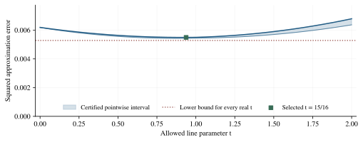
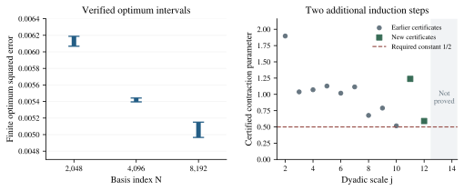
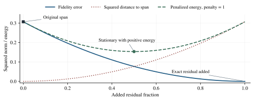

## Abstract

We apply Tomita Energy Logic (TEL) to an approximation problem equivalent to the Riemann hypothesis (RH), using descent to propose approximants and exact arithmetic to certify their full-domain errors. An 8,192-basis experiment gives squared error below 0.0051507316 after 2,972 conjugate-gradient iterations and a 128-million-cell exact check with an infinite-tail bound. This candidate outperforms every real extrapolation along a previously certified residual line. Centered-periodic and moment arguments reduce the quadratic contribution to the earlier tail discrepancy by at least a factor of eight. Compact integer annihilators strengthen finite-minimum lower bounds; the N=4,096 optimum bracket becomes 95.1% narrower, and two additional dyadic scales satisfy the proposed contraction inequality with the original constant $1/2$. We also derive the finite quadratic landscape, thermal concentration, and an admissibility-penalty identity. A positive-mass family transferring clipped neural outputs to the original approximation space would imply RH; its all-accuracy premise remains unproved and is RH-equivalent for the specified complete sampler. The contributions are exact finite results, explicit certificate constructions, and a conditional implication. They do not establish the infinite zero-defect limit or a statistical probability that RH is true.

**Keywords:** Riemann hypothesis; Tomita Energy Logic; Nyman-Beurling criterion; exact certificates; positive mass; gradient optimization; admissibility.

## 1. What an RH claim means in TEL

The companion framework [1] proposes a physics-grounded alternative foundation for AI reasoning and permits discovery through optimization, neural representations, and sampling. Its current acceptance rules retain the target statement and the admissible class. The ambition to replace conventional inference does not change RH into a statement about a surrogate model's equilibrium. The target remains that every nontrivial zero of the Riemann zeta function has real part one half, and a sound translation is required for any new inference rule applied to that target.

The chosen analytic route is the integer-dilation refinement of the Nyman-Beurling criterion due to Báez-Duarte [2], with the weighted cell-space presentation discussed by Bagchi [3]. Probabilistic approximation criteria already exist [4], and approximation-rate obstructions are known [5]. The present work applies an explicit certificate interface and audits proposed AI transformations; it does not introduce the underlying equivalence or the probabilistic method.

The manuscript has two kinds of positive result: unconditional finite certificates and a proof of a conditional implication. Their statuses are stated separately. Section 7 gives the full conditional RH argument, while Sections 8 and 9 identify why its premise has not been discharged. In particular, declaring a new closure postulate would yield a theorem under that postulate, not establish the unchanged RH statement without it.

### 1.1. The custom descent-based domain

The title describes a research objective. The proposed alternative is an operational domain for discovering and evaluating candidate inferences, not an assertion that RH has been solved by changing its meaning. A state records a finite basis, rational coefficients, the current assumption set, and certified energy information. Its mathematical coordinates remain tied to the original approximation problem.

The central relation between a state and its certificates is

$$
% eq:domaincontract
L_N\leq d_N^2\leq\|1-F_c\|_2^2\leq U(c).
$$

Here $L_N$ is a checked lower bound for the entire finite basis, while $U(c)$ bounds the selected candidate. Allowed transitions include coefficient updates, extension to a larger basis, and transfers backed by an explicit error certificate. A neural relaxation or exact-residual reset that leaves the allowed class creates a different state contract; it cannot inherit the original claim automatically.

This domain permits learned or energy-guided discovery while retaining independently interpretable results. Its role as an alternative to conventional mathematical logic is a proposal for research. The exact results reported here still depend on the analytic criterion and certificate arguments stated below; no replacement foundation or unconditional RH conclusion is assumed.

## 2. The original approximation class

Let $I_m=(1/(m+1),1/m)$ and $w_m=1/[m(m+1)]$. Work in the real Hilbert space of functions constant on these arithmetic cells. Define

$$
% eq:basis
g_k(x)=\left\{\frac1{kx}\right\}-\frac1k\left\{\frac1x\right\},
\qquad F_c=\sum_{k=2}^{N}c_k g_k.
$$

On cell $I_m$, the basis value is $(m\bmod k)/k$. Write $S_N=\operatorname{span}\{g_2,\ldots,g_N\}$, let $S$ be the closure of their union, and put

$$
% eq:defect
d_N^2=\min_{F\in S_N}\|1-F\|_2^2,
\qquad D=\lim_{N\to\infty}d_N^2=\operatorname{dist}(1,S)^2.
$$

Finite-dimensional closedness gives the minimum. Nestedness makes the nonnegative sequence decreasing, so the limit exists. The established criterion gives

$$
% eq:criterion
\mathrm{RH}\ \Longleftrightarrow\ D=0\\
\Longleftrightarrow\ \forall j\geq1\ \exists N\geq2\ \exists c\in\mathbb Q^{N-1}:
\|1-F_c\|_2^2<2^{-j}.
$$

Here $N$ is an integer and $c$ is a rational vector of the corresponding length. Rational coefficients suffice because a strict finite-dimensional error margin survives sufficiently small coefficient perturbations.

The balanced normalization in @eq:basis is compatible with the usual formulation on $L^2(0,\infty)$. A finite sum of fractional-part dilates has tail $a/x$ beyond one. Its approximation error controls $|a|$. Subtracting $a\{1/x\}$ eliminates that tail while changing the error by a quantity tending to zero with $a$. The resulting functions are combinations of the balanced $g_k$. Thus the normalization does not insert a new approximation assumption.

## 3. Exact upper and lower certificates

For rational coefficients $c_k=kb_k/Q$, with integer $b_k$ and positive integer $Q$, set $r_m=Q-\sum b_k(m\bmod k)$. The squared error is the positive series

$$
% eq:series
\|1-F_c\|_2^2=\sum_{m\geq1}\frac{r_m^2}{Q^2m(m+1)}.
$$

A finite head can be enclosed by rounding every rational term outward to a common dyadic grid. The integer sieve uses $r_{m+1}=r_m-\sum b_k+\sum_{k\mid m+1}kb_k$; it therefore avoids floating-point evaluation in acceptance.

Over a common period, the mean residual square is

$$
% eq:mean
\mu_b=\left(1-\frac{\sum_k b_k(k-1)}{2Q}\right)^2
+\frac{\sum_{i,k}b_i b_k(\gcd(i,k)^2-1)}{12Q^2}.
$$

The covariance term follows by conditioning on the common residue modulo $\gcd(i,k)$. A partial-sum bound for the centered periodic square is

$$
% eq:discrepancy
K_b=2\sum_k|c_k|(k-1)
+\sum_{i,k}|c_i c_k|\frac{(i-1)(k-1)}{\gcd(i,k)}.
$$

**Proposition 3.1 (full-tail enclosure).** For every cutoff $M\geq1$,

$$
% eq:tail
\left|\sum_{m>M}\frac{r_m^2}{Q^2m(m+1)}-\frac{\mu_b}{M+1}\right|
\leq\frac{K_b}{(M+1)(M+2)}.
$$

**Proof.** Expand the centered residual square into linear and quadratic products of the normalized residue functions. A centered sequence of period $q$ and range at most $a$ has partial sums, from any phase, bounded by $qa$. The linear periods are $k$ and the quadratic periods are $\operatorname{lcm}(i,k)$, giving @eq:discrepancy. Summation by parts against the decreasing weights $1/[m(m+1)]$ bounds the centered tail by the first omitted weight times $K_b$. The mean part telescopes to $\mu_b/(M+1)$.

A lower bound for the optimum over all coefficients requires a different witness. Let finitely supported integers $\alpha_m$ satisfy $\sum_m\alpha_m(m\bmod k)=0$ for every $2\leq k\leq N$. The corresponding cell function $h_m=\alpha_m/w_m$ is orthogonal to $S_N$. Cauchy-Schwarz yields

$$
% eq:dual
d_N^2\geq\frac{(\sum_m\alpha_m)^2}
{\sum_m m(m+1)\alpha_m^2}.
$$

This certificate has no omitted tail because the dual vector is zero beyond its stored support. Orthogonality and the final quotient are checked exactly. Upper bounds concern a chosen approximant; dual lower bounds concern every approximant in the stated finite space.

### 3.1. A centered-periodic improvement

**Proposition 3.2 (centered discrepancy with moment control).** Put $a=1-\sum_k b_k(k-1)/(2Q)$. The tail bound @eq:tail remains valid when $K_b$ is replaced by

$$
% eq:centeredbound
K_b^{\rm cen}=\frac{|a|}{Q}\sum_k|b_k|\left\lfloor\frac{k^2}{4}\right\rfloor
+\frac1{Q^2}\sum_{i,k}|b_i b_k|B_{ik},\\
B_{ik}=\frac{\operatorname{lcm}(i,k)}{24}
\min\{3(i-1)(k-1),\,ik+\gcd(i,k)^2-2\}.
$$

**Proof.** A period-L sequence in $[u,v]$ with mean $\mu$ has a phase-uniform centered partial-sum bound $L(v-u)/4$. For a segment of length n, bound its sum using both the segment and its complement; maximizing the resulting minimum gives $L(\mu-u)(v-\mu)/(v-u)\leq L(v-u)/4$. Whole periods contribute zero, and constant sequences have zero discrepancy. Write $\delta_k(m)=(m\bmod k)-(k-1)/2$. Its positive mass per period is $\lfloor k^2/4\rfloor/2$. The product $X=\delta_i\delta_k$ has period $L=\operatorname{lcm}(i,k)$ and lies in an interval of width $(i-1)(k-1)/2$, giving the first pair bound.

For the second bound, a centered segment is bounded by the total positive mass over one period, equal to $L\mathbb{E}|X-\mathbb{E}X|/2$. Here $C=\mathbb{E}X=(\gcd(i,k)^2-1)/12\geq0$. Cauchy-Schwarz gives $\mathbb{E}|X-C|\leq\mathbb{E}|X|+C\leq[\sqrt{(i^2-1)(k^2-1)}+\gcd(i,k)^2-1]/12$. The square root is at most $ik-1$, since the difference of the squared expressions is $(i-k)^2$. No independence assumption is needed. Take the smaller pair bound, expand $(a-\sum b_k\delta_k/Q)^2$, and subtract its mean. Abel summation gives the tail enclosure.

The quadratic contribution in @eq:centeredbound is at most one eighth of its earlier counterpart, and the moment bound often makes it smaller. This improves a certificate for the same candidate; it does not itself lower that candidate's actual error. The implementation uses exact rational arithmetic. Independent enumeration checks cover all cyclic phases of 243 signed small-basis examples and a separate long-sum enclosure.

### 3.2. Compact exact dual construction

**Proposition 3.3 (zero-moment annihilators).** Fix $M>N$ and choose arbitrary integers $T_{N+1},\ldots,T_M$. Set $T_{M+1}=0$, then define

$$
% eq:compacttails
T_k=-\sum_{r\geq2,\,kr\leq M}T_{kr}\quad(k=N,\ldots,2),
\qquad T_1=-\sum_{k=2}^{M}T_k,\qquad\alpha_m=T_m-T_{m+1}.
$$

These integers satisfy the orthogonality conditions for @eq:dual. A nonzero numerator therefore gives an exact positive lower bound for the entire finite basis.

**Proof.** Telescoping gives $\sum_m m\alpha_m=\sum_k T_k=0$ and $\sum_m\alpha_m\lfloor m/k\rfloor=\sum_{r\geq1}T_{rk}=0$ for $2\leq k\leq N$. Subtracting k times the second identity from the first gives $\sum_m\alpha_m(m\bmod k)=0$. Equation @eq:dual then applies.

The first-moment constraint restricts the proposal class, not RH. We fit a numerical finite-head model with an auxiliary m column, round its free cumulative tails on a $2^{80}$ grid, and enforce the identities by the integer recurrence. The unchanged dual verifier checks every original-basis orthogonality condition. At support 131,072, the N=2,048 and N=4,096 certificates use integers of at most 73 bits and occupy about 1 MB each in compressed form. No large common multiple is needed in this construction. A larger proposal support is not guaranteed to improve the resulting bound; only the verified quotient determines its strength.

## 4. Verified gradient-based results

The new run used the basis through $g_{4096}$, with 4,095 coefficients. A diagonally preconditioned conjugate-gradient method optimized a numerical objective on 131,072 cells plus a periodic-mean tail model. The original constant target started from the earlier N=2048 candidate; the clipped target $h_3$ started from an N=256 transfer candidate. The two runs took 1,827 and 1,976 iterations, respectively. No neural model was trained for this calculation: AI assistance proposed and examined the reasoning routes, while the numerical optimizer was a conventional quadratic method.

The resulting vectors were rationalized with $Q=2^{44}$. Exact acceptance used a $2^{-80}$ rounding grid, 128 million cells for the constant target, and 64 million for $h_3$. The remaining infinite tails were bounded by the periodic certificate and an independent amplitude bound. A new dual on 32,768 cells was reloaded and checked separately.

| Quantity | Previous upper bound | New upper bound |
|---|---:|---:|
| Constant target squared error | 0.006187931848 | 0.0054968440 |
| $h_3$ squared transfer error | 0.010901797 | 0.007523824 |

The displayed earlier gradient-run upper bounds are rounded conservatively. Each is below the respective starting candidate's exact lower error bound, establishing actual improvement of those candidates. The original dual and the line certificate in Section 4.1 first gave

$$
% eq:finiteinterval
0.0045410457<d_{4096}^2<0.0054910377.
$$

Section 4.3 strengthens this interval and extends the basis. No optimizer restricted to the certified finite basis can reach zero or squared error $1/256$. The finite contraction sequence is extended below; an eventual contraction theorem remains unresolved.

The reported modeled losses were approximately 0.005375663273 and 0.007241881483. They fall below the later whole-domain candidate-error intervals. Figure 1 distinguishes those numerical objectives from the certified values. A small numerical gradient therefore was not used as a certificate of the actual optimum or of zero error.

### 4.1. A certified residual-line experiment

The next experiment tests whether a line search or extrapolation can improve the original candidate without leaving the allowed space. Let $F_0$ be the saved N=2048 approximation and $F_1$ the newer N=4096 gradient candidate. For every real $t$, the function $F_t=(1-t)F_0+tF_1$ remains in $S_{4096}$. Put $A=\|1-F_0\|^2$, $B=\|1-F_1\|^2$, and $C=\|F_1-F_0\|^2$. The exact Hilbert-space identity is

$$
% eq:lineenergy
\|1-F_t\|^2=(1-t)A+tB-t(1-t)C.
$$

A separate integer-arithmetic run checks 64 million cells for $C$ and bounds its entire remaining tail. Conservative scalar bounds are $0.0008362555<C<0.0009841907$; exact endpoints are supplied. The earlier verified bounds for $A$ and $B$ are reused with file fingerprints. Interval arithmetic then encloses @eq:lineenergy on the grid $t=0,1/16,\ldots,2$, without another full-domain sum at every point.

The best certified upper bound on this grid occurs at $t=15/16$:

$$
% eq:lineupper
\|1-F_{15/16}\|^2<0.0054910377.
$$

This is also a proved improvement of the actual previous candidate, even though their separate error intervals overlap. Subtracting $B$ in @eq:lineenergy preserves the shared quantity and gives $(1-t)(A-B-tC)$. Substituting the appropriate upper and lower endpoints proves that the new error is at least 0.000002242 smaller than $B$. The new coefficients are an explicit rational combination of the two saved vectors.

The derivative along this line vanishes at $t_*=(A+C-B)/(2C)$. The certificates enclose this point between 0.7693225 and 1.0357440; they do not identify its exact value. They also rule out zero energy at any point on the line. If $a_\pm,b_\pm,c_\pm$ are the corresponding endpoints, set $q_{\max}$ to the larger absolute endpoint of the interval $[a_-+c_- -b_+,a_++c_+-b_-]$. Completing the square gives

$$
% eq:linelower
\min_{t\in\mathbb R}\|1-F_t\|^2
\geq a_- -\frac{q_{\max}^2}{4c_-}>0.0052778026.
$$

This stronger line-specific lower bound applies only to the selected one-dimensional family. It does not replace the lower bound for all of $S_{4096}$, and it does not bound the infinite-basis defect. The experiment supplies a small certified improvement while showing why extrapolating this same direction cannot reach zero.

### 4.2. Checking the complete finite quadratic model

The original full-domain energy, not a shifted loss or a reset in a larger class, remains the target. At finite N it has the convex form @eq:quadratic. The numerical optimizer uses approximations $\widehat G$ and $\widehat v$ obtained from the head and periodic-mean tail. A further experiment directly solves the entire 4,095-variable modeled system, rather than restricting the search to the residual line.

The direct solution $\widehat G^{-1}\widehat v$ has reported modeled error 0.005375663272692566. The rounded gradient candidate has modeled error 0.005375663272692455, an indistinguishable difference at this numerical scale. The direct modeled-gradient norm is approximately $2.44\cdot10^{-15}$. These diagnostics support convergence of the numerical optimizer for its fixed model. The full-domain error of the direct solution was not newly recomputed, and it is not promoted to a new exact certificate.

This separates optimization error, model-integration error, and the finite-basis approximation limit. A better metric can improve conditioning, but it cannot change the minimum of a fixed energy. The full infinite-basis landscape is represented analytically by the closed space S and the defect D; it is not enumerated by a finite matrix. Proving D=0 still requires the argument in Section 7 to be completed, not merely a more thorough minimization of the existing finite model.

### 4.3. Larger descent, stronger certificates, and finite induction

A further experiment extends the original basis to N=8,192, with 8,191 coefficients, and fits a numerical objective on 262,144 cells plus the periodic-mean tail. Starting from the padded N=4,096 vector, diagonally preconditioned conjugate gradient takes 2,972 iterations. Its modeled squared loss decreases from approximately 0.0054292423 to 0.0050264275. The coefficients are rationalized with denominator $2^{44}$. A fresh integer computation checks 128 million cells on a $2^{-80}$ grid; Proposition 3.2 bounds the entire remaining tail. The resulting exact candidate-error enclosure is

$$
% eq:largecandidate
0.0051238722<\|1-F_{8192}\|_2^2<0.0051507316.
$$

The new upper bound is below the old N=4,096 candidate's exact lower bound by more than 0.00028909. It also lies below the all-real line minimum in @eq:linelower by more than 0.00012707. Thus the larger-basis candidate improves on every point along that old line, including its global minimum. This demonstrates an effective expansion of the allowed search domain while preserving the original approximation problem.

Propositions 3.2 and 3.3 also sharpen the finite-optimum intervals. At N=4,096, the final pair narrows the earlier bracket in @eq:finiteinterval by approximately 95.1%. That percentage describes certificate width, not distance to proving RH. The following outward-rounded bounds apply to the true minimum over all coefficients in each listed basis:

| Basis N | Exact-certificate lower bound | Exact-certificate upper bound |
|---|---:|---:|
| 2,048 | 0.0060683759 | 0.0061879319 |
| 4,096 | 0.0053955793 | 0.0054422579 |
| 8,192 | 0.0049660981 | 0.0051507316 |

The N=8,192 lower bound uses a separate compact dual on 262,144 cells. For N=4,096, merely increasing dual support to 1,048,576 cells while retaining the old approximate Gram model gives a worse lower bound, about 0.00521377. Rebuilding the numerical head at that support raises the checked bound to 0.0053955793. Both attempts are retained. Each exact dual is independent of the numerical fit's accuracy and has zero omitted tail. In particular, even the enlarged finite basis cannot have squared error at or below $1/256$. The result leaves the infinite-basis limit open.

For N equal to $2^j$, lower and upper certificates give a directly checkable contraction parameter

$$
% eq:newcontractions
\kappa_j=(j+1)\left(1-\frac{U_{2N}}{L_N}\right),
\qquad d_{2N}^2\leq\left(1-\frac{\kappa_j}{j+1}\right)d_N^2.
$$

The new bounds prove $\kappa_{11}>1.2381$ and $\kappa_{12}>0.5899$. Combined with the earlier certificates for j=2 through 10, they establish the original common constant $1/2$ at every tested scale j=2 through 12. This adds two verified steps to the finite induction sequence. To prove the zero limit by this route, a positive common constant must hold at every sufficiently large j; that universal step is not supplied by the finite computations.

## 5. Energy, stationarity, and ideal cooling

For each finite basis, the Gram matrix $G$ is positive definite. A vanishing linear combination has first-cell slope zero; differences of successive cell values then force each coefficient to vanish inductively. Completing the square gives

$$
% eq:quadratic
E_N(c)=d_N^2+(c-c_*)^T G(c-c_*),\qquad c_*=G^{-1}v.
$$

Gradient flow satisfies $c(t)-c_*=e^{-2Gt}(c(0)-c_*)$ and approaches $d_N^2$. For a particularly transparent actual example,

$$
% eq:smallcase
E_2(c)=1-\log2+(\log2)(1-c/2)^2,
\qquad \min E_2=1-\log2>0.
$$

Indeed $g_2=1/2$ on odd-indexed cells and zero on even ones, and the odd-cell weights sum to $\log2$. The derivative is zero at $c=2$, while the global minimum is positive. Thus stationarity and zero residual are different predicates even for the actual RH basis.

For an ideal Gibbs sampler with density proportional to $e^{-E_N(c)/T}$, completing the square gives a Gaussian of mean $c_*$ and covariance $(T/2)G^{-1}$. Therefore

$$
% eq:gibbs
\mathbb{E}[E_N(C)-d_N^2]=\frac{N-1}{2}T,
\qquad \Pr(E_N(C)<\varepsilon)>0\ \Longleftrightarrow\ \varepsilon>d_N^2.
$$

The positivity equivalence follows because strict quadratic sublevels are either empty or nonempty open sets, and the density is positive everywhere. Cooling provides mass near the existing minimum. It cannot make a below-minimum sublevel nonempty.

**Proposition 5.1 (ideal cooling limit).** For samples $C_N$ with these marginals and temperatures $T_N=N^{-4}$, one has $E_N(C_N)\to D$ almost surely. Independence between different $N$ is unnecessary.

**Proof.** Let $X_N=E_N(C_N)-d_N^2\geq0$. Its expectation is at most $1/(2N^3)$. For each positive integer $m$, Markov's inequality makes $\sum_N\Pr(X_N>1/m)$ finite. The first Borel-Cantelli lemma and a countable intersection imply $X_N\to0$ almost surely. Since $d_N^2\to D$, the conclusion follows.

This is a theorem about ideal mathematical sampling laws. No exact Gibbs sampler or physical experiment was implemented in the reported optimization. The theorem identifies the limit as the unknown defect; it does not determine whether that defect is zero.

## 6. The penalty and reset attempts

An unrestricted reset adds the exact residual: $F+(1-F)=1$. It has zero error in the enlarged class containing that residual. It does not establish that the correction is an allowed finite combination or belongs to the original closed span.

A softer attempt introduces an admissibility penalty. For $H$ in the ambient cell space, let

$$
% eq:penalty
J_\lambda(H)=\|1-H\|^2+\lambda\operatorname{dist}(H,S_N)^2,
\qquad \lambda>0.
$$

Writing $1=p+r$ with $p=P_{S_N}1$, and $H=s+z$ with $z\perp S_N$, completes the square and gives

$$
% eq:penaltyminimum
H_*=p+\frac{r}{1+\lambda},\qquad
\min J_\lambda=\frac{\lambda}{1+\lambda}d_N^2.
$$

At this minimizer the fidelity error is $[\lambda/(1+\lambda)]^2d_N^2$, while the squared distance outside the space is $d_N^2/(1+\lambda)^2$. Sending the penalty to zero removes the fidelity error by admitting the missing residual. Sending it to infinity restores the constrained minimum. The same decomposition holds with $S$ and $D$.

For positive penalty, zero derivative and zero minimum together still require the original defect to vanish. When the penalty is zero, the reset is allowed and both can vanish without a conclusion about the original problem. TEL labels this as a scope change rather than a proof.

## 7. A complete conditional RH implication

Neural clipping supplies a useful intermediate family. Define $h_k=\min(1,kg_k)$. On cell $I_m$ it equals one unless $k$ divides $m$, in which case it is zero. Thus

$$
% eq:clip
\|1-h_k\|_2^2=\sum_{\ell\geq1}\frac1{k\ell(k\ell+1)}<\frac2{k^2}.
$$

The function is a simple ReLU expression, $h_k=kg_k-\operatorname{ReLU}(kg_k-1)$. The inequality proves a zero-error limit for a class containing these nonlinear outputs. The remaining task is their transfer back into the original class.

Fix $k_j=2^{j+2}$ for $j\geq1$. Enumerate all finite rational original-basis coefficient descriptions and finite verification cutoffs as $w_1,w_2,\ldots$, assigning mass $2^{-\ell}$ to description $w_\ell$. Duplicated coefficient descriptions are harmless. Each valid finite description has positive mass, and the distribution is fixed independently of RH.

For each $j$, let $V_j$ soundly accept a description only when its original-basis function satisfies $\|h_{k_j}-F\|_2^2<2^{-j-2}$. A complete strict-error verifier can use an exact rational head and a pointwise amplitude tail tending to zero with the cutoff. Thus any rational candidate with a strict margin is accepted for some finite cutoff. This is a mathematical existence construction, not an efficient search proposal.

**Transfer premise $\mathcal H_{\rm tr}$.** The accepted mass is positive at every level:

$$
% eq:hypothesis
\forall j\geq1:\quad\mu(V_j=1)>0.
$$

**Theorem 7.1 (TEL conditional zero-defect theorem).** Under $\mathcal H_{\rm tr}$, the original approximation defect is zero and RH holds.

**Proof.** By SWC positive mass and verifier soundness, for each $j$ there exists an original finite rational combination $F_j$ with squared transfer error below $2^{-j-2}$. Equation @eq:clip gives $\|1-h_{k_j}\|_2^2<2^{-2j-3}\leq2^{-j-2}$. The triangle inequality therefore yields

$$
% eq:closureproof
\|1-F_j\|_2
\leq\|1-h_{k_j}\|_2+\|h_{k_j}-F_j\|_2
<2\sqrt{2^{-j-2}}=2^{-j/2}.
$$

Squaring gives the universal approximation condition in @eq:criterion. Hence $D=0$ and RH follows. All steps of this implication are accounted for by the TEL contract, positive-mass rule, and transfer rule.

**Status of the premise.** The present work does not prove $\mathcal H_{\rm tr}$. For the full-support complete verifier just described, the premise is equivalent to RH. To see the converse, suppose RH holds, so $1\in S$. Integer dilation preserves $S$ through $D_a g_k=g_{ak}-g_a/k$, with zero extension and $g_1=0$. Differences of $D_m1$ and $D_{m+1}1$ are the cell indicators. Thus $S$ is the whole cell space. Each $h_{k_j}$ can then be approximated with a strict margin by rational finite combinations; completeness and full support make its accepted mass positive.

Consequently Theorem 7.1 is a complete proof of an implication, not a completed proof of its antecedent. Adding $\mathcal H_{\rm tr}$ as a new AI-logic postulate would prove RH in the resulting conditional system, but would supply no independent justification for that postulate.

## 8. What the transfer attempts establish

The coefficient-extraction functional for a cell function, with $F_0=0$, is

$$
% eq:extract
\Lambda_n(F)=-\sum_{d\mid n}\mu(n/d)(F_d-F_{d-1}).
$$

It is continuous and satisfies $\Lambda_n(g_k)=\mathbf1_{n=k}$. For $h_3$ and every prime $p>3$ with $p=2\bmod3$, it has value one. Infinitely many such primes exist by the elementary product-minus-one argument. Therefore $h_3$ is not any finite original-basis combination. This does not place it outside the closed span; precisely that distinction motivates the transfer problem.

Finite transfers have been constructed and verified. At N=16, 64, and 256, saved squared-error upper bounds for approximating $h_3$ are 0.021410234, 0.014343561, and 0.010901797. The newer N=4096 bound is 0.007523824. Corresponding finite results for $h_8$ and $h_{32}$ are also included in the supplement. They do not establish arbitrary accuracy for a fixed target or the joint large-$k$ transfer required in Section 7.

An exact cell-matching construction was tested separately. It matches the first N-1 cells of $h_3$ but has verified total squared errors in the conservative intervals (0.05473425, 0.05473439), (0.05551771, 0.05555646), and (0.05932572, 0.06529911) at N=16, 64, and 256. The exact intervals show increasing error at these sizes. Pointwise matching therefore does not justify a norm-convergence induction.

A basic shift gives another precise test. For $(RF)_1=0$ and $(RF)_m=F_{m-1}$, the operator is contractive on the cell space, but $Rg_2=1/2-g_2$. Hence $Rg_2\in S$ is already equivalent to $1\in S$. Boundedness of an AI transformation in the ambient space does not establish preservation of the relevant subspace.

More generally, distance to a closed set is 1-Lipschitz, so

$$
% eq:distances
\left|\operatorname{dist}(h_k,S)-\sqrt D\right|
\leq\|h_k-1\|_2<\frac{\sqrt2}{k}.
$$

The limiting transfer distance is exactly the original unknown distance. This identity locates the unresolved problem rather than bypassing it.

## 9. Small defects and statistical interpretation

The earlier SWC investigation [6] also examined the Balazard-Saias-Yor logarithmic mean, as presented in [7]:

$$
% eq:bsy
B=\frac1{2\pi}\int_{-\infty}^{\infty}
\frac{\log|\zeta(\tfrac12+it)|}{\tfrac14+t^2}\,dt
=\sum_{\Re\rho>1/2}\log\left|\frac{\rho}{1-\rho}\right|.
$$

Every summand is positive, and $B=0$ is equivalent to RH. The published verification through $H=3\cdot10^{12}$ [8], together with an explicit zero-count estimate [9], gives the corollary

$$
% eq:bsybound
0\leq B<\frac{17}{6H}+\frac{16}{H^2}<10^{-12}.
$$

For completeness, a right-hand zero contributes at most $1/(2\gamma^2)$. Pairing conjugate and reflected zeros bounds $B$ by one half of the sum of $\gamma^{-2}$ over all positive-ordinate zeros above H. Integration by parts and the cited counting estimate give $(\log H+5)/(4\pi H)+(\log H+3)/(2H^2)$. Using $\log H<29$ and $\pi>3$ gives @eq:bsybound. The included exact script checks the final rational comparisons; the external zero-verification computation was not repeated here.

This small bound is a corollary of existing results, not a new numerical record or a probability of RH. No equality between $B$ and the discrete approximation defect $D$ is asserted. A very high zero or one arbitrarily near the line could contribute a very small positive amount. Shrinking an unexamined tail does not eliminate contributions accumulated below the moving cutoff.

Likewise, a high success probability for a fixed approximation tolerance is not a posterior probability of RH. Under the full-support sampler of Section 7, positivity at every level would settle RH; the finite certificates establish only their declared levels. Toy models with zero and positive limiting errors can have identical acceptance events through any prescribed finite set of accuracy levels.

Recent literature supplies context without the missing closure theorem. Guth and Maynard's published large-value estimates [10] improve zero-density analysis. A 2026 Colombeau-Beurling preprint [11] states another criterion involving association and uniform L2 boundedness. Its abstract-level scope was checked, but its full proof was not independently validated or used as a premise here. Neither contextual citation supplies $\mathcal H_{\rm tr}$ for the present sampler.

Ehm [13] derives analytic formulas and quadratic-form decompositions for Nyman-Beurling Gram matrices. The finite landscape itself is therefore part of an established line of work. The additions here concern the stated centered remainder bounds, exact integer certificate construction, and reproducible finite experiments. No priority over that literature or improvement to a zero-density theorem is claimed.

Optimal-rate work also requires attention to assumptions. Bettin, Conrey and Farmer [12] give a conditional approximation result; it is not used as an unconditional bound for the present sampler. A new numerical fit or an energy-law analogy cannot remove hypotheses from a cited theorem. The literature review therefore guides the candidate constructions while preserving the status of each analytic input.

## 10. Validation, limitations, and conclusion

The accompanying records include both gradient stages, exact infinite-tail bounds, compact duals at three basis sizes, the residual-line certificate, finite clipped-target transfers, and unsuccessful proposal and reset attempts. The 54-test implementation suite includes the new centered-tail checks; the companion eight-case protocol audit is separate. The N=8,192 head was freshly evaluated on 128 million cells, while sharpening its tail and the N=4,096 tail reuses their checked rational head records. All new dual orthogonality identities and contraction quotients are rechecked exactly. The rule and SAT experiments in Paper I have finite Boolean scope; they do not validate $\mathcal H_{\rm tr}$ in this arithmetic Hilbert space.

The unconditional results are the sharper tail certificate, the compact annihilator construction, the enlarged-basis candidate, stronger finite-optimum bounds, and two additional verified contraction steps. The N=8,192 candidate escapes the positive floor of the earlier one-dimensional search family while remaining in the original approximation class. The conditional RH implication identifies the still-missing universal transfer premise. The energy analysis explains why stationarity, ideal cooling, or zero loss in an enlarged class does not discharge it. The context-management audit in Paper I concerns implementation compatibility and makes no change to these premises.

No new unbounded-basis estimate is proved. Theorem 7.1 establishes what would follow from an all-accuracy positive-mass transfer; it does not supply one. RH therefore remains unresolved in this application of TEL.

**Authorship and assistance.** Kenju Tomita supplied the SWC method and the AI-energy reasoning proposal. Codex assisted with derivations, source checks, code, and drafting. This is a research preprint. No independent peer review, physical experiment, or proof-assistant formalization of the claimed analytic deductions is asserted.

**Rights.** Copyright 2026 Kenju Tomita. All rights reserved. Supplementary materials retain any separately stated licenses.

## References

[1] K. Tomita. Tomita Energy Logic: Toward a Physics-Grounded Foundation for AI Reasoning and Proof. Companion manuscript, Paper I (2026), supplied with this draft pair.

[2] L. Báez-Duarte. A strengthening of the Nyman-Beurling criterion for the Riemann hypothesis. Rendiconti Lincei, Matematica e Applicazioni 14 (2003), 5-11. [Author preprint](https://arxiv.org/abs/math/0202141).

[3] B. Bagchi. On Nyman, Beurling and Baez-Duarte's Hilbert space reformulation of the Riemann hypothesis. Proceedings of the Indian Academy of Sciences, Mathematical Sciences 116 (2006), 137-146. [Author preprint](https://arxiv.org/abs/math/0607733).

[4] S. Darses and E. Hillion. On probabilistic generalizations of the Nyman-Beurling criterion for the zeta function. Confluentes Mathematici (2021). [Author preprint](https://arxiv.org/abs/1805.06733v4).

[5] J.-F. Burnol. A lower bound in an approximation problem involving the zeros of the Riemann zeta function. Advances in Mathematics 170 (2002), 56-70. [Author preprint](https://arxiv.org/abs/math/0103058).

[6] K. Tomita. Stochastic Witness Calculus, version 6, and the accompanying RH working records. [Public SWC project](https://ephemerent.com/journal/preprint/stochastic-witness-calculus). The supplied local source and computational records are identified in the reproducibility package.

[7] H. M. Bui, S. J. Lester and M. B. Milinovich. On Balazard, Saias, and Yor's equivalence to the Riemann Hypothesis. Journal of Mathematical Analysis and Applications 409 (2014), 244-253. [Author preprint](https://arxiv.org/abs/1306.0856).

[8] D. J. Platt and T. S. Trudgian. The Riemann hypothesis is true up to $3\cdot10^{12}$. Bulletin of the London Mathematical Society 53 (2021), 792-797. [Author preprint](https://arxiv.org/abs/2004.09765).

[9] T. S. Trudgian. An improved upper bound for the argument of the Riemann zeta-function on the critical line II. Journal of Number Theory 134 (2014), 280-292. [Author preprint](https://arxiv.org/abs/1208.5846).

[10] L. Guth and J. Maynard. New large value estimates for Dirichlet polynomials. Annals of Mathematics 203 (2026), 623-675. [Published article](https://annals.math.princeton.edu/2026/203-2/p06).

[11] A. Alvarez Cruz and E. A. Alvarez Gutierrez. A Colombeau-Beurling criterion for the Riemann hypothesis. arXiv:2606.22562v2 (2026). [Preprint](https://arxiv.org/abs/2606.22562v2).

[12] S. Bettin, J. B. Conrey and D. W. Farmer. An optimal choice of Dirichlet polynomials for the Nyman-Beurling criterion. arXiv:1211.5191 (2012). [Author preprint](https://arxiv.org/abs/1211.5191).

[13] W. Ehm. On certain Gram matrices and their associated series. arXiv:2405.06349v2 (2024). [Author preprint](https://arxiv.org/abs/2405.06349v2).
